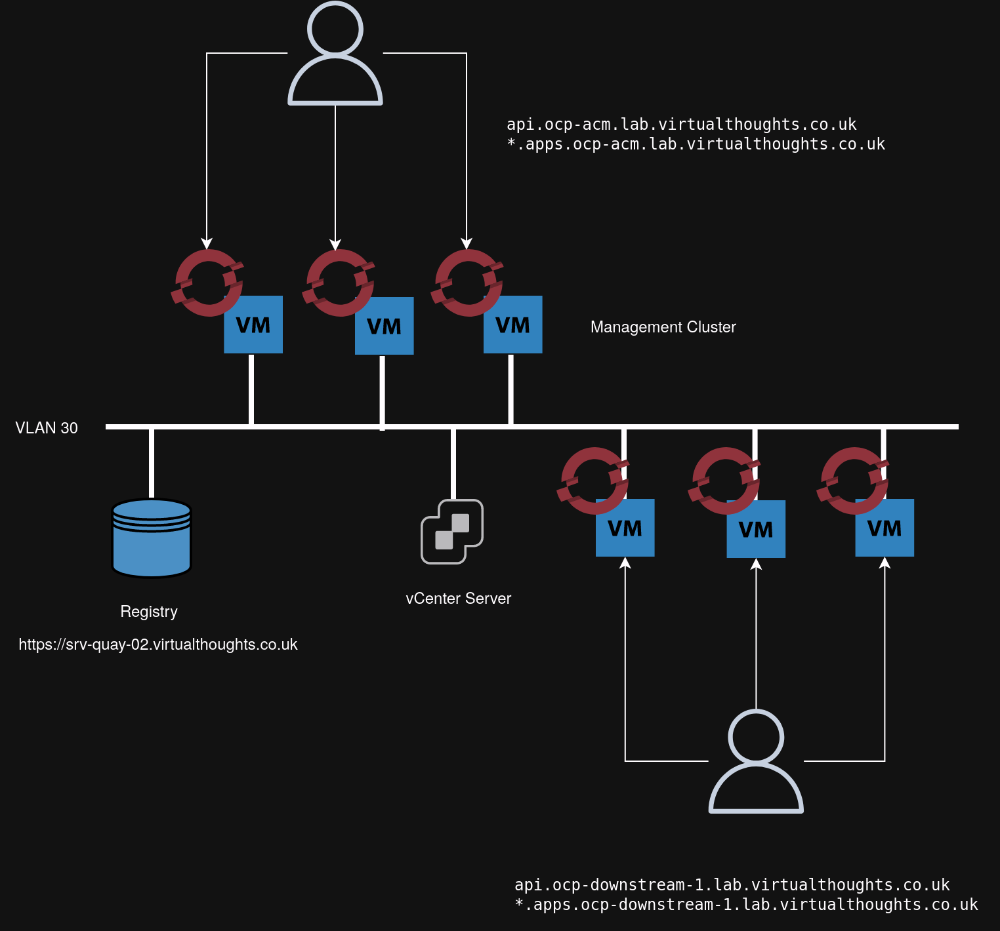

# Cluster Design



## 1 - Management Cluster

The management cluster will have [advanced cluster management](https://www.redhat.com/en/technologies/management/advanced-cluster-management) installed which will be used to deploy further "Downstream" clusters using vCenter as a infrastructure provider. 

## 2 - Local Registry

OCP distro images are >10GB. Therefore, to save on bandwidth for cluster creation, a local registry will be used to accommodate this


```
apiVersion: operator.openshift.io/v1alpha1
kind: ImageContentSourcePolicy
metadata:
  name: example
spec:
  repositoryDigestMirrors:
  - mirrors:
    - srv-quay-02.virtualthoughts.co.uk:8443/ocp4/openshift4
    source: quay.io/openshift-release-dev/ocp-release
  - mirrors:
    - srv-quay-02.virtualthoughts.co.uk:8443/ocp4/openshift4
    source: quay.io/openshift-release-dev/ocp-v4.0-art-dev
```

[Source](https://docs.openshift.com/container-platform/4.14/installing/disconnected_install/installing-mirroring-creating-registry.html)


### 2.1 - Certs

Registry certs are created by certbot:

```
certbot certonly \
    --authenticator dns-azure \   
    --preferred-challenges dns \   
    --noninteractive \  
    --agree-tos \
    --email david.holder@gmail.com \ 
    --dns-azure-config /home/quay/azure.ini \   
    -d srv-quay-02.virtualthoughts.co.uk
```

`azure.ini` is located in the vault.

### 2.2 - Create Registry

```
./mirror-registry install \    
    --quayHostname srv-quay-02.virtualthoughts.co.uk \    
    --quayRoot /var/lib/quay \    
    --sslCert /etc/letsencrypt/live/srv-quay-02.virtualthoughts.co.uk/fullchain.pem \
    --sslKey /etc/letsencrypt/live/srv-quay-02.virtualthoughts.co.uk/privkey.pem
```

### 2.3 - Mirror Images

```
oc adm release mirror -a ${LOCAL_SECRET_JSON} --from=quay.io/${PRODUCT_REPO}/${RELEASE_NAME}:${OCP_RELEASE}-${ARCHITECTURE} --to=${LOCAL_REGISTRY}/${LOCAL_REPOSITORY} --to-release-image=${LOCAL_REGISTRY}/${LOCAL_REPOSITORY}:${OCP_RELEASE}-${ARCHITECTURE}
```

Where

```
OCP_RELEASE=4.14.1
LOCAL_REGISTRY='srv-quay-02.virtualthoughts.co.uk:8443'
LOCAL_REPOSITORY='ocp4/openshift4'
PRODUCT_REPO='openshift-release-dev'
LOCAL_SECRET_JSON='/home/quay/pull-secret-json' 
RELEASE_NAME="ocp-release"
ARCHITECTURE=x86_64
```