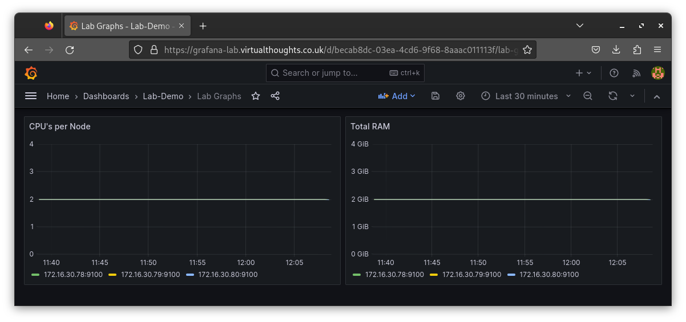

# Recording Rules 

## CPU's per node:

```yaml
apiVersion: monitoring.coreos.com/v1
kind: PrometheusRule
metadata:
  name: node-cpu-count-recording-rule
  namespace: prom-stack
spec:
  groups:
    - name: node-cpu-count-group
      rules:
        - record: lab_node:total_cpu_count
          expr: count without(cpu, mode) (node_cpu_seconds_total{mode="idle", cluster="workload-cluster"})
```

```yaml
apiVersion: monitoring.coreos.com/v1
kind: PrometheusRule
metadata:
  name: node-total-mem-gb
  namespace: prom-stack
spec:
  groups:
    - name: node-total-mem-gb
      rules:
        - record: lab_node:total_memory_gb
          expr: (node_memory_MemTotal_bytes{cluster="workload-cluster"} / 1024^3)
```

```yaml
apiVersion: monitoring.coreos.com/v1
kind: PrometheusRule
metadata:
  name: node-mem-per-cpu
  namespace: prom-stack
spec:
  groups:
    - name: node-mem-per-cpu
      rules:
        - record: lab_node:mem_per_cpu_bytes
          expr: node_memory_Percpu_bytes{cluster="workload-cluster"}
```

# Visualising with Grafana

Example of basic graphs leveraging the above recording rules:

