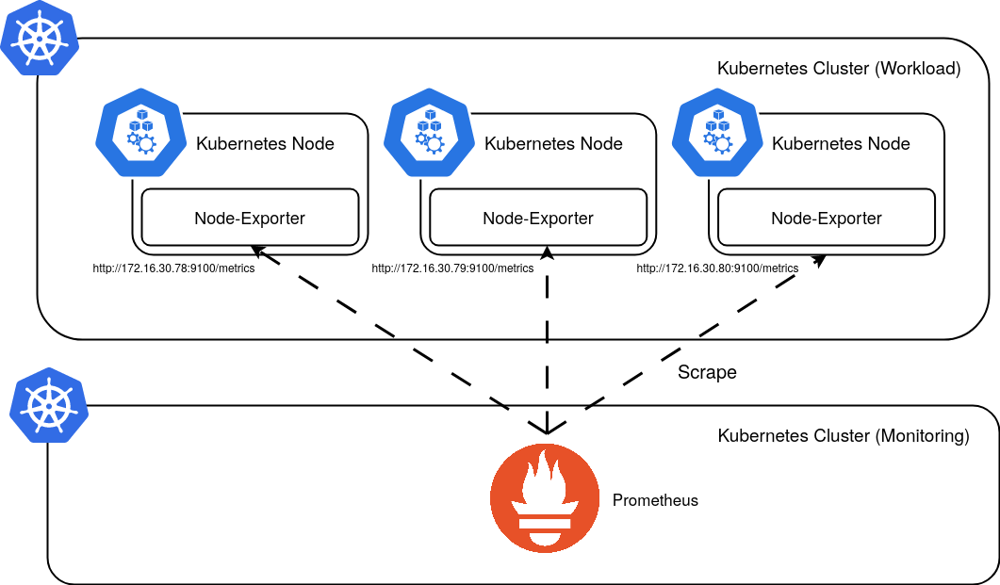
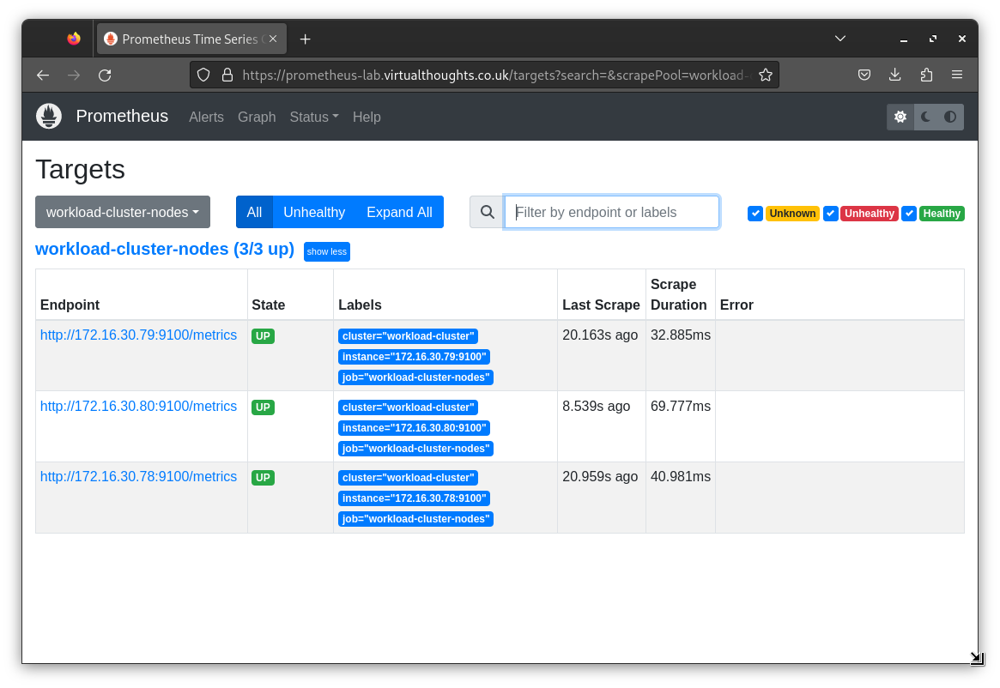
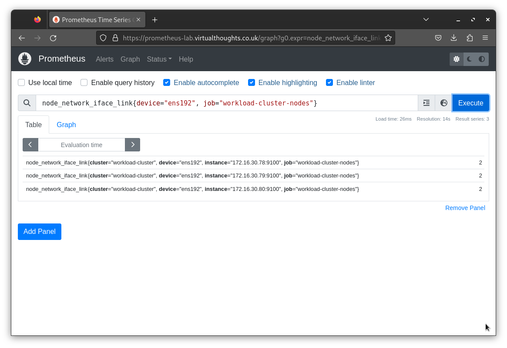

# Scrape Configuration

Using the Prometheus Operator, `ServiceMonitor` and `PodMonitor` are standard abstractions for service discovery within
a Kubernetes cluster. However, in this example, we are scraping metrics from external nodes.

Two ways to approach this include:

* Modifying the `Prometheus` yaml file and directly injecting additional scrape configs
* Modifying the `Prometheus` yaml file and reference an existing secret with `additionalScrapeConfigs`

For this example, the latter is used as a provides a less error-prone and scalable way to manage additional scrape configurations.

##  Additional Scrape config

This scrape configuration references the three nodes in the Workload cluster. In addition, a label is automatically created 
that identifies the cluster these nodes reside in. This is helpful to distinguish these metrics from other nodes that may be scraped
for similar metrics in the future.

```yaml
- job_name: 'workload-cluster-nodes'
  static_configs:
  - targets:
    - '172.16.30.79:9100'
    - '172.16.30.80:9100'
    - '172.16.30.78:9100'
    labels:
      cluster: 'workload-cluster'
```

## Create Secret

`kubectl create secret generic additional-scrape-configs --from-file=node-exporter-scrape.yaml --dry-run=client -oyaml > additional-scrape-configs.yaml`

## Modify Prometheus Instance with `additionalScrapeConfigs`

To include this scrape configuration we need to modify the corresponding `Prometheus` object:

```yaml
apiVersion: monitoring.coreos.com/v1
kind: Prometheus
spec:
  additionalScrapeConfigs:
    key: node-exporter-scrape.yaml
    name: additional-scrape-configs
```

We can visualise this configuration with the following:



## Validate Scrape Config

From the Prometheus UI, we can validate the scrape configuration is configured and working as expected:



From the Prometheus UI, we can validate metrics have been scraped with a simple `PromQL` query:

## Test Scrape Config

