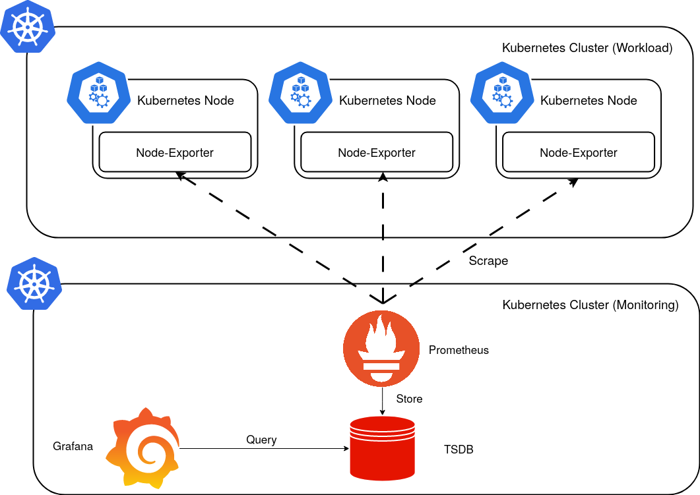

# High Level Design

Two clusters will be leveraged for this lab:

1. A dedicated Kubernetes cluster for the `kube-prometheus` stack.
2. A Kubernetes cluster with nodes running `node-exporter` which the monitoring cluster will scrape.

## Workload Cluster

* The workload cluster is used to host end-user applications.
* Each worker node will have `node-exporter` installed for the purpose of exposing metrics.
* Three nodes comprise the cluster, each hosting `etcd`, `control plane` and `worker` roles.

|             | Node 1       | Node 2       | Node 2       |
|-------------|--------------|--------------|--------------|
| OS          | Ubuntu 22.04 | Ubuntu 22.04 | Ubuntu 22.04 |
| CPU         | 2            | 2            | 2            |
| Memory (GB) | 6            | 6            | 6            |
| Disk (GB)   | 80           | 80           | 80           |

Kubernetes Version: `1.26`

## Monitoring Cluster

* The monitoring cluster is used to host the `kube-prometheus` stack.
* `kube-prometheus` leverages the Prometheus Operator.
* A specific scrape configuration will be used to scrape for external `node-exporter` metrics.

|             | Node 1       | Node 2       | Node 2       |
|-------------|--------------|--------------|--------------|
| OS          | Ubuntu 22.04 | Ubuntu 22.04 | Ubuntu 22.04 |
| CPU         | 4            | 4            | 4            |
| Memory (GB) | 8            | 8            | 8            |
| Disk (GB)   | 80           | 80           | 80           |

Kubernetes Version: `1.26`

!!! note

    Kube-Prometheus [maintains a compatibility matrix](https://github.com/prometheus-operator/kube-prometheus#compatibility)
    and should be checked prior to any installation
    